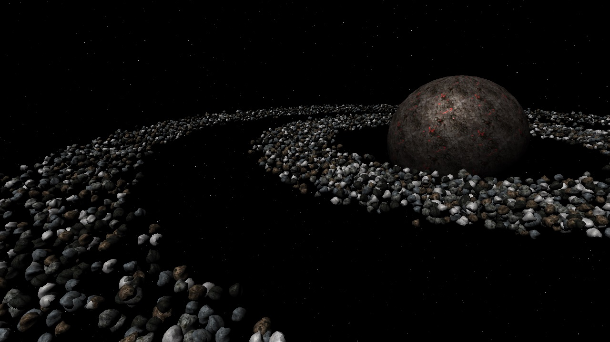

# Instancing

This example has been adapted from Sascha Willem's "instancing" Vulkan sample project from https://github.com/SaschaWillems/Vulkan.

This example uses instanced rendering to draw a large number of meshes in a single draw call. At a high level, the scene consists of three distinct objects:

* A "starfield" in the background, giving the illusion of space.
* A single planet in the center of the scene, around which the rocks orbit.
* A large number (8000) of individual rock instances, placed at random locations on two orbital rings around the planet.

## Instanced Drawing

Veldrid supports both indexed and non-indexed instanced drawing. This example uses indexed instanced drawing via [CommandList.DrawIndexed](https://mellinoe.github.io/veldrid-docs/api/Veldrid.CommandList.html#Veldrid_CommandList_DrawIndexed_System_UInt32_System_UInt32_System_UInt32_System_Int32_System_UInt32_). With one call to this function, all 8000 of the orbiting rocks are drawn.

The vertex data for the rocks is split into two DeviceBuffer objects. The first buffer contains "per-vertex" data: it is different for every single vertex in the rock mesh. The second buffer contains "per-instance" data: it is different for every rock _instance_.

Per-Vertex
* 3D vertex position
* 3D vertex normal
* 2D texture coordinate

Per-Instance
* 3D instance position
* 3D instance rotation (the angle of rotation around each axis)
* 3D instance scale
* A 32-bit signed integer, identifying the _texture array layer_ used by this instance.

All of the data above is static. It is generated when the program starts and never changes.

## Texture Arrays

This example uses a 2D array Texture to store the data used by rock instances. This lets us put 5 different textures into a single view which is read by the instance fragment shader. In order to determine which array layer to sample from, a _per-instance vertex attribute_ is provided to each instance. These values are randomly generated and stored in the per-instance DeviceBuffer.

## Dynamic Rotation

In order to make the scene more interesting, the instanced rocks have two dynamic rotations, a "local" and a "global" rotation. Each of these values is stored in a uniform DeviceBuffer accessible to the instanced rock Pipeline. Before each rendered frame, these values are incremented according to the elapsed time.

* Local rotation: Describes how much the object is rotated around its **local** Y-axis. This controls how much the rocks "spin" on themselves.
* Global rotation: Describes how much the object is rotated around the **global** Y-axis. This controls how quickly the rocks orbit the central planet.
